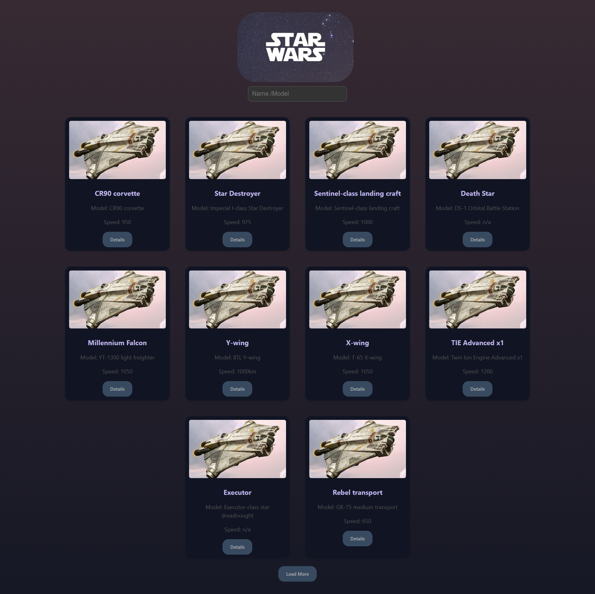
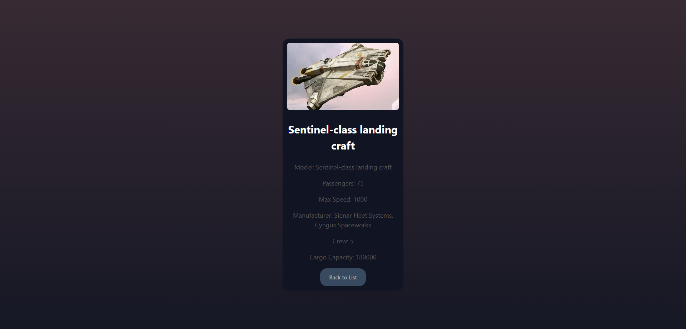

# 🌌🚀 Star Wars Starships Catalog

This is a simple web application that fetches and displays a list of starships from the Star Wars universe. Users can search for starships by name or model and view detailed information about each starship.

## ✨ Features

- **Searchable Starships**: Allows users to search for starships by name or model.
- **Paginated Data**: The list of starships is paginated, and users can load more results by clicking the "Load More" button.
- **Starship Details**: Users can view detailed information about each starship by clicking the "Details" button.
- **Responsive Design**: The app is designed to be responsive and works well on different screen sizes.

## 🖥️📱 Live Demo

You can view a live version of the project here: [Star Wars Starships Catalog](YOUR_LIVE_DEMO_LINK)

## 📸 Screenshots

Here are some screenshots of the application: 

 


## Technologies Used

- **React**: For building the user interface and managing the application state.
- **Axios**: To make API requests and fetch starship data from the Star Wars API.
- **React Router**: For navigation between the main list and individual starship details pages.
- **CSS**: For styling the application.
- **Star Wars API**: Data is fetched from the public [Star Wars API](https://swapi.dev/) to display starship information.

## 🛠️ Setup and Installation 

To get this project up and running on your local machine, follow these steps:

## Installation

To set up the project on your local machine, follow these steps:

1. **Clone the repository**:
    ```bash
    git clone https://github.com/elfdrkn/StarWars-React.git
    ```
2. **Navigate to the project directory**:
    ```bash
    cd starwars
    ```
3. **Install dependencies**:
    ```bash
    npm install
    ```
4. **Start the application**:
    ```bash
    npm start
    ```
    Open your browser and go to `http://localhost:3000` to view the application.
